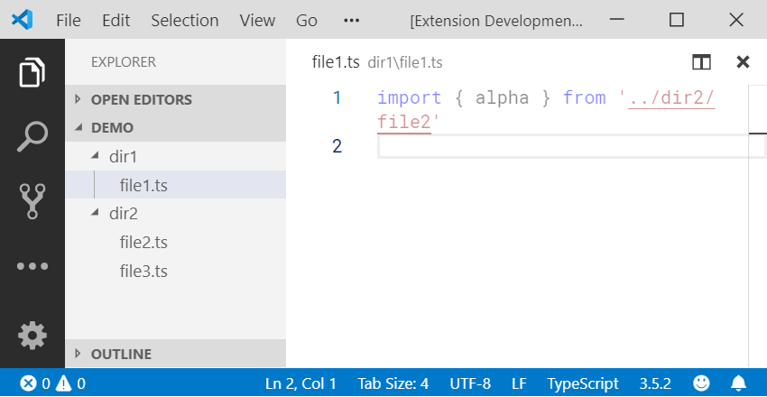
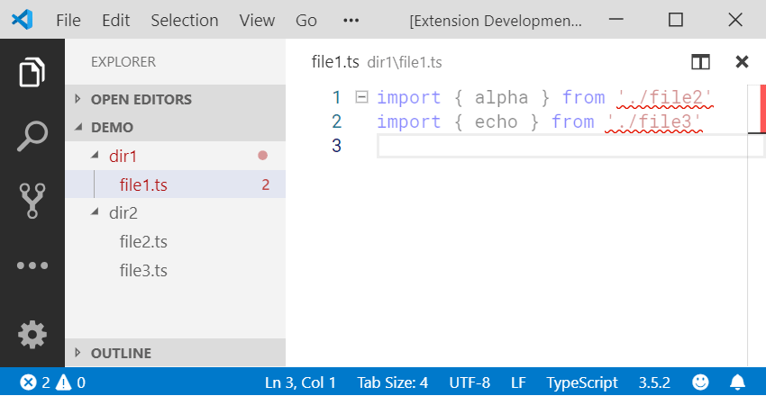

**Import Quicken** is yet another Visual Studio Code extension that helps inserting `import`/`require` snippets in JavaScript, TypeScript, and Stylus.

This extension is formerly named **Code Quicken** and heavily inspired by [**Quick Require**](https://marketplace.visualstudio.com/items?itemName=milkmidi.vs-code-quick-require), but it is written from scratch because it supports only `import` and `require` in JavaScript and could not be customized at all. For example, in some JavaScript convention, you might want to omit the file extension (`.js`) and the semi-colon (`;`) at the end of the line, hence it becomes `import MyFile from './MyFile'`.

## Available commands

- Insert an import/require statement (default keybinding: _Ctrl+Shift+I_)
- Fix broken import/require statements
- Convert require to import statements

## Basic usage

Simply press _Ctrl+Shift+I_ on your keyboard to list all matching identifiers, and choose one file that you would like to insert a snippet based on it.

Fixing broken path in an `import`/`require` statement has never been this easy. The command _Import Quicken: Fix Import/Require_ will try to find the closest match based on the file path without hassle. If more than one match is found, the extension will prompt you.

## Configurations

This extension offers very minimal configurations. JavaScript/TypeScript convention is automatically recognized and replicated across the workspace when adding a new `import`/`require` statement.
